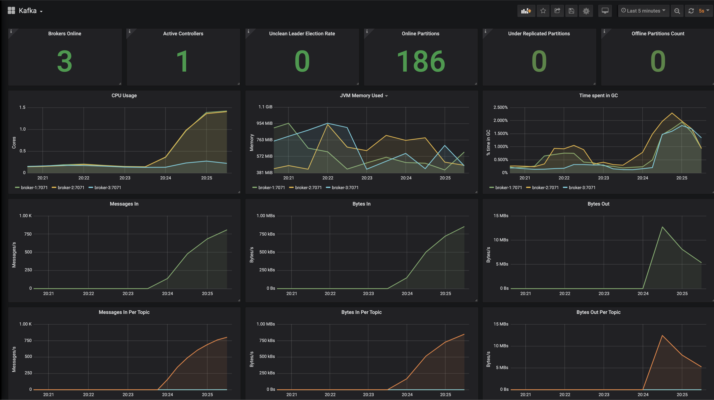
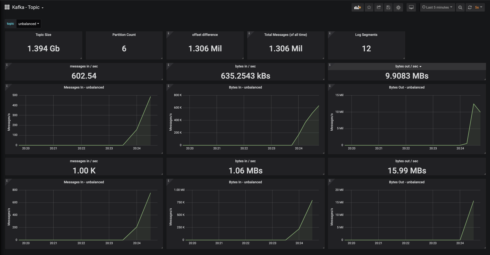
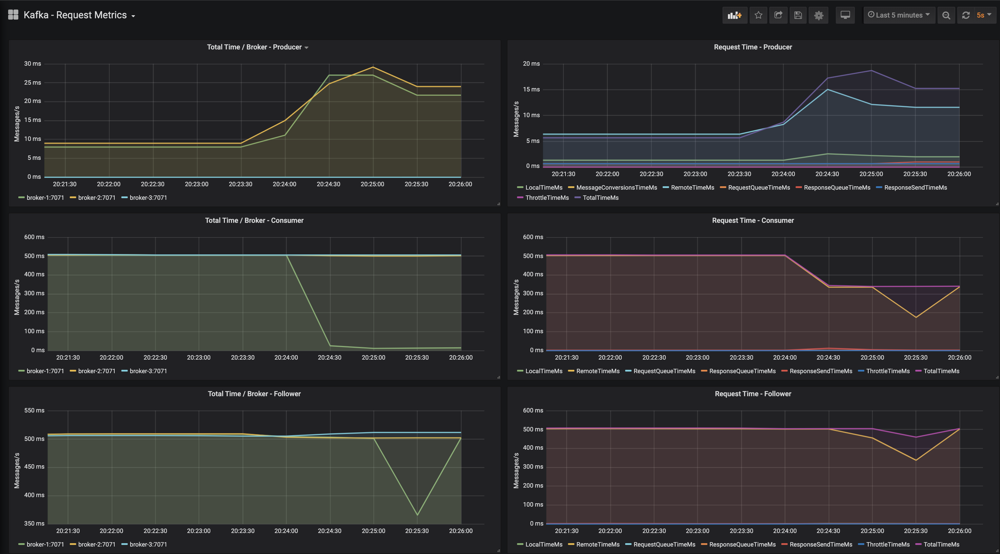
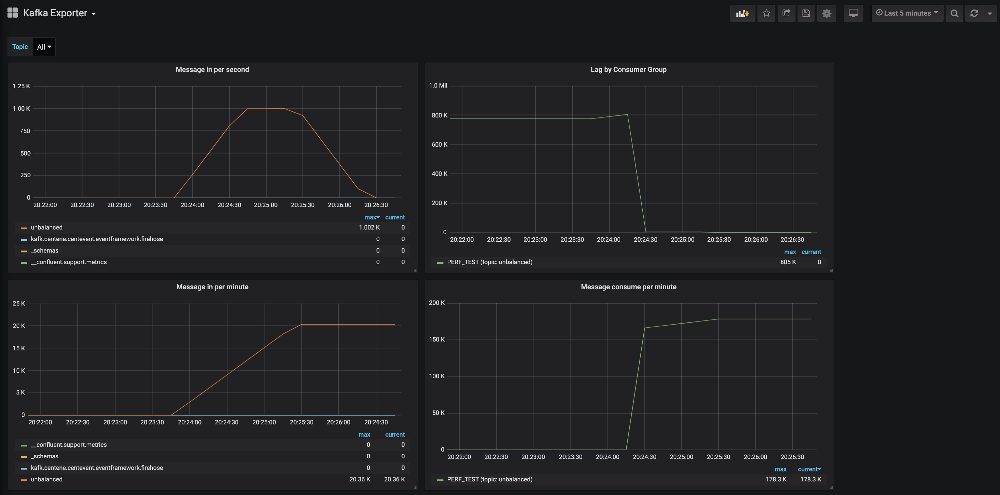

## SSL Certificates

  * SSL Certificates must be created prior to running the cluster, unless you plan
    on removing SSL settings.
    
  * See the `README.md` file within the ssl-broker directory.
  
  
## Apache Kafka Cluster

  * `cluster` directory
  
  * configuration
  
    * 1 Zookeeper
    * 3 Brokers
    * 1 Schema Registry
    * 1 Rest Proxy
   
* User standard docker compose functions to run the cluster.
The network is exposed externally to allow for monitoring to be expressed in their
own docker compose file.

  * start
    ```  
    docker-compose up -d
    ```

  * stop & destroy
    ```  
    docker-compose down
    ```

* Zookeeper and Brokers are configured to use JMX Prometheus Exporter to extract
metrics from the cluster into prometheus.
    
* Ports

| hostname | port | localhost port | description |
| --- | --- | --- | --- |
| zookeeper | 2181 | 2181 | the zookeepr administration port |
| zookeeper | 2888 | - | inner zookeeper communication |
| zookeeper | 3888 | - | zookeeper leader election |
| broker-1  | 9092 | - | Internal plaintext port for client connection to the broker. |
| broker-1  | 19092 | 19092 | Docker host plaintext port for client connection to the broker. |
| broker-1  | 7071 | 17071 | Prometheus JMX endpoint |
| broker-1  | 7072 | 17072 | Joloika JMX endpoint |
| broker-2  | 9092 | - | Internal plaintext port for client connection to the broker. |
| broker-2  | 29092 | 29092 | Docker host plaintext port for client connection to the broker. |
| broker-2  | 7071 | 27071 | Prometheus JMX endpoint |
| broker-2  | 7072 | 27072 | Joloika JMX endpoint |
| broker-3  | 9092 | - | Internal plaintext port for client connection to the broker. |
| broker-3  | 39092 | 39092 | Docker host plaintext port for client connection to the broker. |
| broker-3  | 7071 | 37071 | Prometheus JMX endpoint |
| broker-3  | 7072 | 37072 | Joloika JMX endpoint |
| broker-4  | 9092 | - | Internal plaintext port for client connection to the broker. |
| broker-4  | 49092 | 49092 | Docker host plaintext port for client connection to the broker. |
| broker-4  | 7071 | 47071 | Prometheus JMX endpoint |
| broker-4  | 7072 | 47072 | Joloika JMX endpoint |
| schema-registry | 8081 | 8081 | standard point for accessing and registing Avro schemas |

## Monitoring

 * `monitoring` directory
 
 * configuration
   
   * prometheus
   * grafana
   * kafka exporter
   * kafkahq
     * KafkaHQ provides access to the cluster via SSL, copy the truststore from the cluster
     into the monitoring directory `monitoring/certs/kafka.truststore.jks`. If you change the broker password,
     you will need to change it in the `kafkahq.yml` file as well.
 
 * Grafana
 
   * Administration Credentials
   
     * Username: `admin`
     * Password: `grafana`
     
   * Dashboards
   
     * Kafka - Standard Health of the cluster
     
       
    
     * Kafka Topic - provides metrics for the selected topic
     
       
       
       ** Row 1 - Message In / Bytes In / Bytes Out, Kafka Rate averages.
       
       ** Row 2 - Message In / Bytes In / Bytes Out, Kafka totals, and Grafana does the averaging.
      
     *  Kafka Request Metrics - showcases the JMX Metrics around client response times
     
       
       
     * Kafka Exporter - show metrics obtained from the Kafka Exporter tool, consumer lag is the key feature
     
       
     
 * KafkaHQ
 
   * Administration Credentials
   
     * Username: `admin`
     * Password: `kafkahq`
     

## Bin

 * commands to help administrate your cluster.  It assumes the confluent community source or confluent enterprise
installation is on your MacOS or Linux environment.

## Scripts

 * scripts used to test your cluster. This includes performance scripts and additional support.
